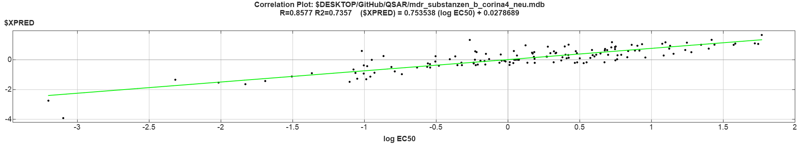
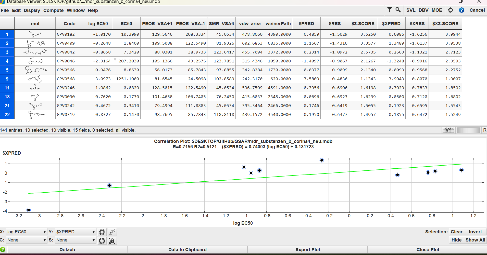
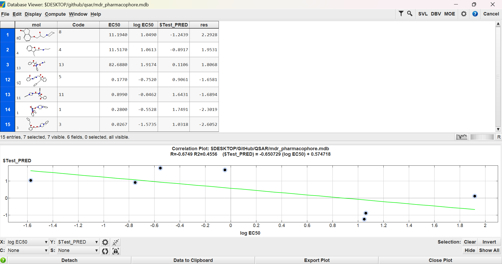

# 2D-QSAR Modeling for hERG Inhibition Liability Prediction

## Project Overview
The **hERG** (human Ether-à-go-go-Related Gene) potassium channel is a critical safety "anti-target" in drug discovery. Unintended blockage of this channel can lead to fatal cardiac arrhythmias, such as Long QT Syndrome and Torsades de Pointes. 

This project establishes a **2D-QSAR (Quantitative Structure-Activity Relationship) model** to predict inhibition potency ($\log EC_{50}$) against hERG. By correlating physical-chemical descriptors with biological activity, this model serves as a predictive tool for early-stage safety pharmacology screening.

---

## Methodology
The study followed a rigorous computational drug design protocol:

### 1. Data Cleaning & Preparation
* **Initial Dataset:** 163 hERG inhibitors.
* **Cleaning:** Removed entries without structures, resulting in **141 valid observations**.
* **Descriptor Calculation:** Generated 212 2D descriptors using **MOE (Molecular Operating Environment)**.
* **Feature Selection:** Removed descriptors with constant or zero values, leaving **185 candidate descriptors** for modeling.

### 2. Model Development (Training)
* **Regression Technique:** Partial Least Squares (PLS) with a component limit of 10.
* **Optimization:** Descriptors were refined one-by-one based on statistical importance to maintain an optimal **5:1 ratio** of molecules to descriptors, preventing over-fitting.

---

## Statistical Performance
The final model was optimized to **6 key descriptors**.

| Metric | Value |
| :--- | :--- |
| **Observations ($N$)** | 141 |
| **Descriptors ($k$)** | 6 |
| **Correlation Coefficient ($R^2$)** | **0.76808** |
| **Root Mean Square Error (RMSE)** | 0.42636 |
| **Cross-Validated $R^2$ ($Q^2$)** | **0.73565** |
| **Cross-Validated RMSE** | 0.45557 |

### Estimated Linear Model Equation
The model predicts $\log EC_{50}$ using the following optimized descriptors:

$$\log EC_{50} = -5.40188 + 0.01053(PEOE\_VSA-1) - 0.00118(EC_{50}) - 0.01647(PEOE\_VSA+1) + 0.00995(SMR\_VSA6) + 0.01489(vdw\_area) - 0.00040(weinerPath)$$

---

## Validation & Outlier Analysis

### Training Set Performance
The correlation plot shows a strong linear fit between experimental and predicted activities, with a cross-validated $R^2$ of ~0.74 indicating robust predictive power.

  
*Figure 1: Observed vs. Predicted activities for the Training Set ($R^2 = 0.7357$).*

### Outlier Detection
Outliers were identified using the cross-validated Z-score (**$XZ\_SCORE**).
* **Criteria:** $|Z| > 1.5$.
* **Results:** 10 molecules were identified as outliers in the training set, indicating they deviate from the usual 95% behavior of the model.

  
*Figure 2: Statistical identification of outliers in the training database based on $XZ\_SCORE.*

---
## Test Set Prediction & Toxicity Screening
The validated model was applied to the test dataset (`mdr_pharmacophore.mdb`) to identify potent blockers and evaluate predictive accuracy. 

  
*Figure 3: Database viewer showing experimental values vs. predicted values ($Test_PRED$) and residuals ($res$).*

### High-Risk Inhibitors & Significant Outliers
Analysis of the 15-molecule test set identified 7 significant outliers (highlighted in Figure 3) where the model's prediction deviated by over 1 log unit.

| Molecule | Experimental $EC_{50}$ (nM) | $\log EC_{50}$ | $Test\_PRED$ | Residual ($res$) | Status |
| :--- | :--- | :--- | :--- | :--- | :--- |
| **Mol 3** | **0.0267** | -1.5735 | 1.0318 | **-2.6052** | High-Potency Outlier |
| **Mol 1** | **0.2800** | -0.5528 | 1.7491 | **-2.3019** | High-Potency Outlier |
| **Mol 5** | **0.1770** | -0.7520 | 0.9061 | **-1.6581** | High-Potency Outlier |
| **Mol 11** | **0.8990** | -0.0462 | 1.6431 | **-1.6894** | High-Potency Outlier |
| **Mol 8** | 11.1940 | 1.0490 | -1.2439 | **2.2928** | Weak-Potency Outlier |
| **Mol 4** | 11.5170 | 1.0613 | -0.8917 | **1.9531** | Weak-Potency Outlier |
| **Mol 13** | 82.6880 | 1.9174 | 0.1106 | **1.8068** | Weak-Potency Outlier |

---

## Conclusion
This study developed a statistically robust 2D-QSAR model ($R^2 = 0.768$) that correlates molecular properties with hERG inhibition. However, validation against the 15-molecule test set revealed critical limitations in the model’s **Applicability Domain**, with 7 identified outliers representing nearly 47% of the set. Specifically, sub-nanomolar inhibitors like Molecules 1, 3, 5, and 11 exhibited extreme potency (as low as **0.0267 nM**) that the model significantly under-predicted. These compounds represent a severe risk for hERG-mediated cardiotoxicity and sudden cardiac arrest; they are rejected from development to meet FDA safety standards. Conversely, for molecules with higher $EC_{50}$ values like Molecule 13 (82.688 nM), the model over-predicted toxicity.Statistically, high residual values (up to 2.6 log units) suggest that while the 6 optimized descriptors capture general trends, they lack the sensitivity required to model specific binding interactions of the most dangerous sub-nanomolar blockers, necessitating further structural refinement in future iterations.

